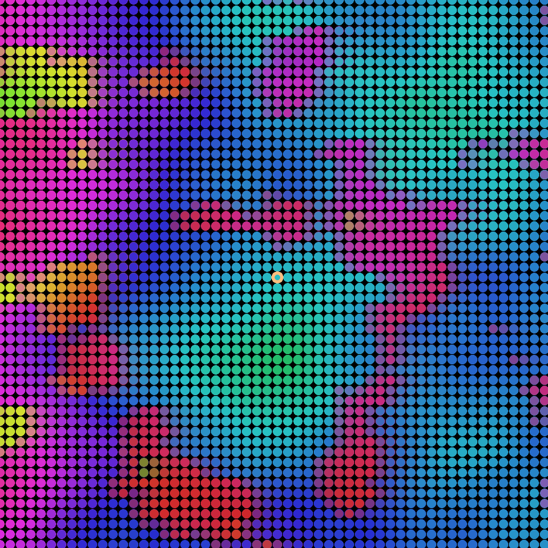

# 250921 #

**Dynamic Color Circles with Intelligent Camera Movement**

A generative art project built with p5.js that creates an infinite field of colorful circles with noise-based properties and a camera system that follows descending hue values.




## From this point on, GenIA description....  :-) ##


## Features

### 🎨 Visual Elements
- **Grid-based circle placement**: Circles positioned on a regular grid with customizable spacing
- **Noise-driven properties**: Circle radius and colors determined by Perlin noise
- **Multi-layered color system**: Three complementary color variations (base, +120°, +240°) for rich visual diversity
- **Transparency layering**: Circles rendered with alpha blending for depth and complexity
- **HSB color space**: Full hue spectrum utilization for vibrant colors

### 🎯 Intelligent Camera System
- **Hue-following movement**: Camera automatically moves toward circles with descending hue values
- **Rightward progression**: Camera always moves to the right, creating systematic exploration
- **Circular hue logic**: Handles color wheel wraparound (360° → 0°) intelligently
- **Central circle highlighting**: Yellow border marks the current center point
- **Grid-snapped movement**: Smooth movement aligned to the circle grid

### 🎮 Interactive Controls
- **Live GUI**: Real-time parameter adjustment with instant visual feedback
- **Keyboard shortcuts**:
  - `1` - Toggle GUI visibility
  - `b` or `B` - Clear canvas
  - `s` or `S` - Save current frame as PNG
- **Adjustable parameters**:
  - Grid size and circle radius
  - Color saturation and transparency
  - Movement speed and noise scales
  - Time progression speed

## Technical Implementation

### Core Technologies
- **p5.js**: Creative coding framework for graphics and interaction
- **Perlin Noise**: Organic, natural-looking random values for smooth animations
- **HSB Color Mode**: Hue-Saturation-Brightness for intuitive color manipulation
- **Modular Architecture**: Separate files for main logic and GUI controls

### Camera Movement Algorithm
The camera uses a sophisticated algorithm to create purposeful movement:

1. **Evaluate adjacent positions**: Checks 8 surrounding grid positions
2. **Calculate hue values**: Determines color at each position using noise functions
3. **Find optimal direction**: Selects the position with the shortest "downward" hue distance
4. **Handle circularity**: Manages color wheel wraparound (red → violet → blue → red)
5. **Constrain movement**: Only allows rightward or vertical movement

### Color Generation
Colors are generated through layered noise functions:
- **Base hue rotation**: Slow global hue drift over time
- **Local hue variation**: Position-based hue modulation
- **Brightness mapping**: Noise-driven brightness variation (70-100%)
- **Multi-palette system**: Three offset hues create color harmony

## File Structure

```
├── index.html          # Main HTML file
├── main.js            # Core application logic and drawing functions
├── gui.js             # Interactive controls and parameter management
├── p5.min.js          # p5.js library
└── README.md          # This documentation
```

## Getting Started

### Prerequisites
- Modern web browser with JavaScript support
- Local web server (recommended for development)

### Running the Project
1. Clone or download the project files
2. Open `index.html` in a web browser, or
3. Serve the directory using a local web server:
   ```bash
   # Using Python 3
   python -m http.server 8000
   
   # Using Node.js (with live-server)
   npx live-server
   ```
4. Navigate to the served URL in your browser

### Controls
- **Press `1`** to show/hide the parameter controls
- **Adjust sliders** for real-time visual changes
- **Press `b`** to clear the canvas and restart
- **Press `s`** to save the current frame

## Customization

### Parameters
All visual aspects can be customized through the GUI:

- **`gridSize`**: Distance between circle centers (4-40)
- **`rMin/rMax`**: Circle radius range (0-80)
- **`alphaFill`**: Transparency level (0-30)
- **`moveSpeed`**: Camera movement speed (0-5)
- **`scaleR/scaleC`**: Noise scaling for radius and color
- **`tSpeed`**: Animation time progression (0-0.02)

### Code Modifications
- **`paramsDefault1`**: Modify default parameter values
- **`hueBase`**: Change base hue (currently randomized)
- **`snapToGrid`**: Enable/disable grid-aligned movement
- **Color offsets**: Adjust `hueOffset1` and `hueOffset2` for different color harmonies

## Visual Styles

The project creates an ever-evolving landscape of colors that follows these principles:

1. **Organic flow**: Noise-based generation creates natural, flowing patterns
2. **Color progression**: Camera movement creates gradual color transitions
3. **Layered complexity**: Multiple transparent circles create depth
4. **Systematic exploration**: Rightward movement ensures comprehensive coverage
5. **Harmonic relationships**: Three-color system maintains visual coherence

## Technical Details

### Performance Considerations
- Grid-based rendering for consistent performance
- Efficient noise calculations with offset values
- Minimal DOM manipulation for smooth animation
- Canvas positioning optimization for GUI overlay

### Browser Compatibility
- Modern browsers supporting ES6 modules
- Hardware acceleration recommended for smooth animation
- Tested on Chrome, Firefox, Safari, and Edge

## Future Enhancements

Potential improvements and features:
- Multiple camera movement algorithms
- Recording/playback of camera paths
- Export animations as video files
- Interactive color palette selection
- Multi-resolution output options
- WebGL renderer for enhanced performance

## License

This project is open source. Feel free to use, modify, and distribute according to your needs.

## Credits

Developed using p5.js creative coding framework. Inspired by generative art principles and algorithmic aesthetics.

---

*Generated on September 21, 2025*